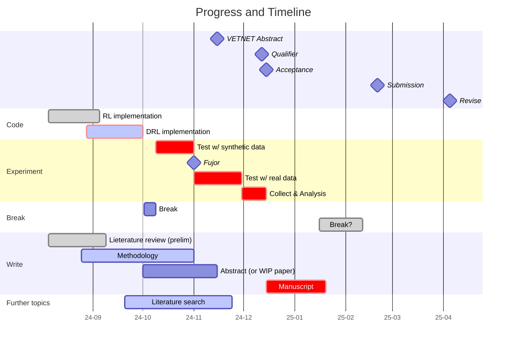

# 1. Code
# 2. Framework

# 3. Discussion
## 3.1 Prospsective plan

### Why not IEEE EduCon 2025?
**Time related**: Need more testing, collecting data and analysis need more time

**Topics limited**, they ask you to select 1 topic from the following:
 - K-12 STEM Education Initiatives
 - Student-centered Learning Environments
 - Engaging Undergraduate Students in Research
 - Digital Transformation
 - Ethical Challenges
 - Women for Leadership in Engineering Equity, Diversity, and Inclusion
 - **Future-oriented and Personalized Educational Concepts**
 - Game-based Learning and Gamification
 - Non-traditional Lab concepts
 - Multidisciplinary and Transdisciplinary Education
 - Virtual and Remote Labs and Classrooms
 - Generative AI in learning and educational settings
 - Education in the Industry 5.0 era

So far only the *Future-oriented and Personalized Educational Concepts* seems relevant, yet still more polishing and specific strategy to write my manuscript for it to fit in this topic.

## 3.2 Journal/Conference strategies
Journal picks: 
 - [IJRVET](https://journals.sub.uni-hamburg.de/hup2/ijrvet/issue/view/54) IF 1.8 (?), tighter topics range
 - [Education Assessment](https://www.tandfonline.com/toc/heda20/current) IF 2.1, practice (?)
 - [**Educational Assessment, Evaluation and Accountability**](https://link.springer.com/journal/11092) IF 2.8, theory and practice

Conference:
 - [Conference Crossing Boundaries in Vocational Education and Training](https://vetnetsite.org/conferences/2025-crossing-boundaries-in-palma/) closer to current schedule, wider range of topics
 - [**AEA Europe**](https://aea-europe.net/conferences/) Normally held in Nov, submission April, 2025 possible
 - [**IEEE EduCon**](https://educon-conference.org/) Need more preparation, 2025 not in reach
 - [***ACM RecSys***](https://recsys.acm.org/) Normally held in September, asbstract April, 2025 possible

## 3.3 Further topics?