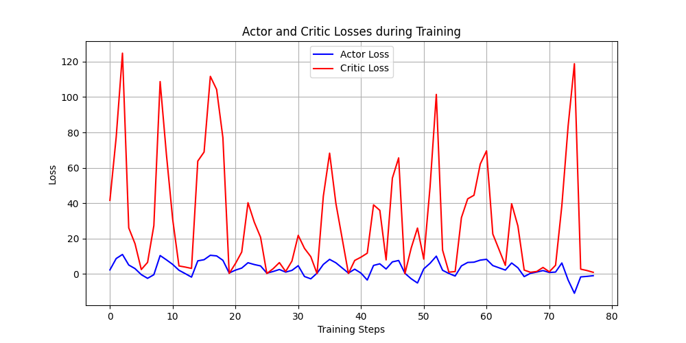
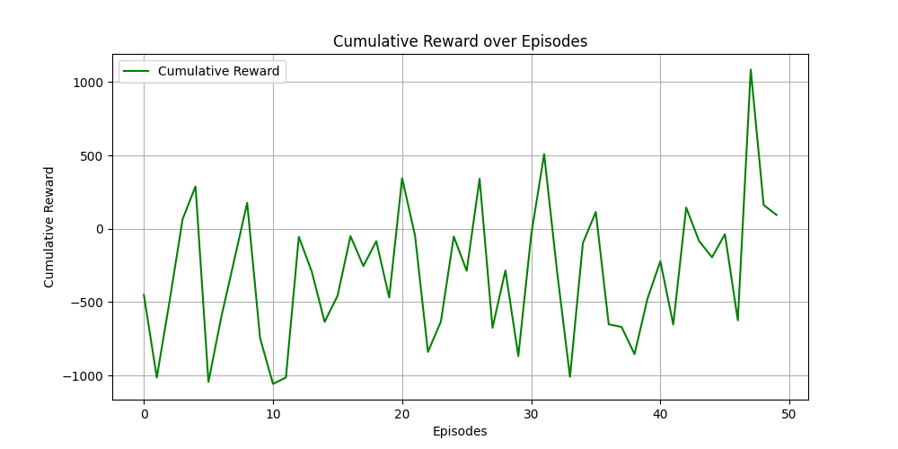

# Training related issues

## 1. Training time

Oct 20

Training Episodes: 50/50 [52:14<00:00, **62.69s/it**]

Nov 5 **-115.84%** 

Training Episodes: 50/50 [24:12<00:00, **29.04s/it**]

Nov 7 **-45.05%**

Training Episodes: 50/50 [16:41<00:00, **20.03s/it**]

Nov 11 **FINAL**

### 1.5 it/s

## 2. GPU usage
Oct 20
Only 3% gpu used.

Nov 3
Max 15% usage, seems ok

Nov 11
Full usage

## 3. Training results
### Oct 20

### Nov 5

### Nov 7

