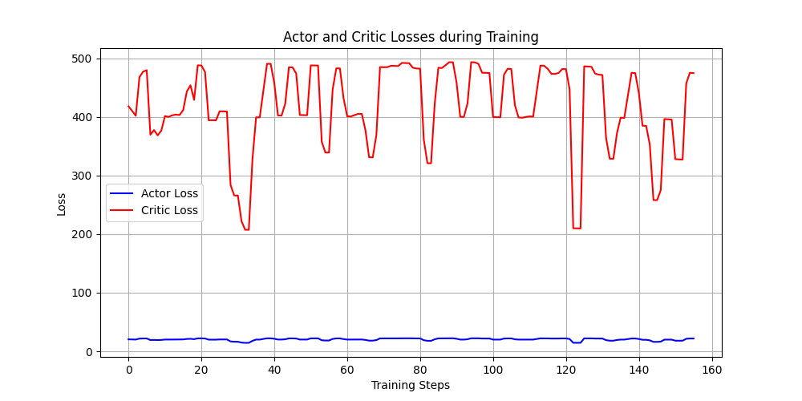
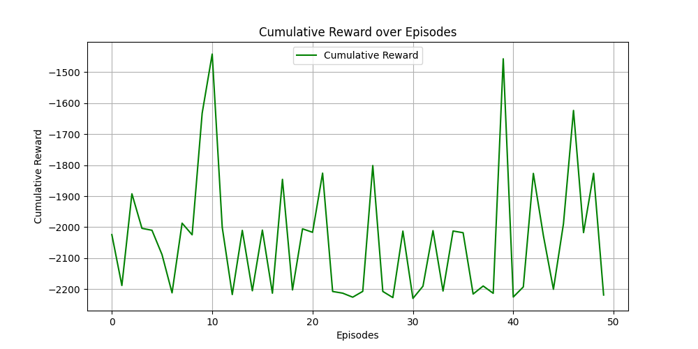

# Training related issues


## 1. Training time
```
agent.py:105: UserWarning: Creating a tensor from a list of numpy.ndarrays is extremely slow. Please consider converting the list to a single numpy.ndarray with numpy.array() before converting to a tensor. (Triggered internally at ..\torch\csrc\utils\tensor_new.cpp:277.)

states = torch.FloatTensor([entry[0] for entry in batch])
```


  Training Episodes: 100%|█████████████████████████████████████████████████████████████████████████████████████████████████████████████████████████████████████████████████████████████████████████| 50/50 [52:14<00:00, 62.69s/it]

## 2. GPU usage
Only 3% gpu used.

## 3. Training results

