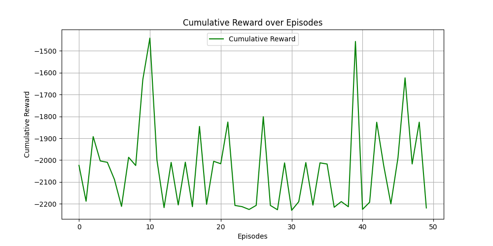
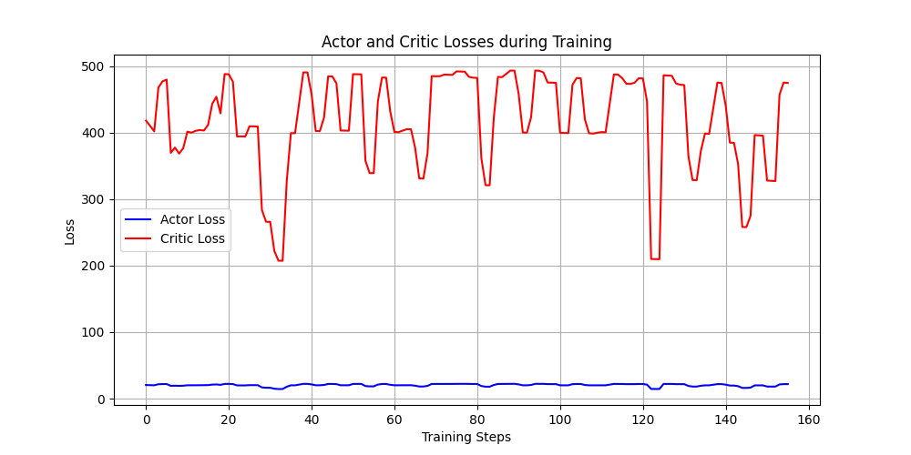

# Training related issues


## 1. Training time
```
agent.py:105: UserWarning: Creating a tensor from a list of numpy.ndarrays is extremely slow. Please consider converting the list to a single numpy.ndarray with numpy.array() before converting to a tensor. (Triggered internally at ..\torch\csrc\utils\tensor_new.cpp:277.)

states = torch.FloatTensor([entry[0] for entry in batch])
```

Oct 29

Training Episodes: 50/50 [52:14<00:00, **62.69s/it**]

Nov 7 **-115.84%** 

Training Episodes: 50/50 [24:12<00:00, **29.04s/it**]


## 2. GPU usage
Oct 29
Only 3% gpu used.

Nov 7
Max 15% usage, seems ok

## 3. Training results
### Oct 29


### Nov 7

